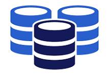

# Tema 1: Introducció a Bases de Dades
 
 
UD01 - Introducció a les Bases de Dades

---

## Definició

Una base de dades és un conjunt d'informació relacionada que representa un conjunt d'entitats del món real i les seves relacions i que es troba agrupada o estructurada.

exemple: en una biblioteca, els llibres estan relacionats amb els socis que els han demanat en préstec i amb l’editorial que l’ha publicat

---

## Conceptes (1/4)

* **Món real**: Està constituït pels objectes de la realitat que ens interessen i amb els quals haurem de treballar.

* **Món conceptual**: Està format pel conjunt d’informacions obtingudes gràcies a l'observació de la part del món real que ens interessa. 

* **Disseny lògic**: etapa en què es transforma l'esquema conceptual en un esquema lògic que utilitzarà estructures de dades.

* **Disseny físic**: Etapa en què es transforma el disseny lògic a les ordres específiques del SGBD a emprar.

--

## Conceptes  (2/4)

Dada
és tota la informació que un ordinador registra i emmagatzema.

Informació
és el resultat de la transformació de les dades perquè aportin coneixement.

Entitat
Una entitat és un objecte del món real que podem distingir de la resta d'objectes de manera única.

--

## Conceptes  (3/4)

Atributs
són les característiques que defineixen o identifiquen una entitat. 
Un atribut identificador és el que permet distingir inequívocament cada registre de la resta.

Domini
és el conjunt de valors que un atribut determinat pot prendre.

--

## Conceptes  (4/4)

Registre
també anomenat fila o tupla, representa un element únic de dades d'una entitat
 
Arxiu de dades
col·lecció d'informació relacionada

Consulta (query) pot ser
la recerca d'un registre específic o
de tots els registres que satisfacin un conjunt de criteris.

Informe (report)
és un llistat ordenat dels camps i registres seleccionats en un format fàcil de llegir.

---

## Definició

Sistema Gestor de Bases de Dades (SGBD)
és un conjunt de programes que permeten l'emmagatzematge, modificació i extracció de la informació d'una base de dades, a més a més proporciona eines per afegir, esborrar, modificar i analitzar les dades.

---

## Definició, format i composició

fitxer o arxiu
és la quantitat d'informació estructurada i sobre un mateix tema que es tracta com una unitat d’emmagatzematge.
format i tipus de fitxer
determina com interpretar la informació que conté.
arxius de bases de dades 
es componen de registres homogenis que contenen informació relativa a cada objecte de la base de dades. A cada element d'informació del registre es denomina camp.

---

## Operacions sobre les dades

Creació i esborrat
Modificació del disseny de l’estructura
Modificació del contingut dels registres
Inserció/eliminació de registres
Recuperació de la informació
Manteniment: Reparació i compactació

---

## Organització dels arxius de dades

Seqüencial
Registres emmagatzemats de forma contigua.
Encadenada
Cada registre conté un punter que apunta al registre següent.
Indexada
A part del fitxer de dades al qual s’accedeix de forma directa, també tenim un fitxer d'índexs al qual s’accedeix de forma seqüencial.
Directa
Es calcula la posició en l’arxiu de dades en funció a un adreçament.

---

## Avantatges de les Bases de Dades

Permeten
emmagatzemar grans quantitats d'informació
compartir la informació
accedir ràpidament a la informació
eliminar la informació repetida o redundant.
augmentar la productivitat
reduir l'espai d'emmagatzematge
millorar la seguretat de la informació
millorar el manteniment.

---

## Inconvenients de les bases de dades

Augment de la mida d’emmagatzematge.
Augment del cost econòmic.
Actualització dels usuaris.
Major vulnerabilitat a les fallades.

---

## Característiques dels SGBD

Independència física i lògica de les dades.
Redundància mínima.
Accés concurrent a les dades.
Integritat de les dades.
Seguretat d’accés i auditoria.
Backup i recuperació.
Accés a través de llenguatges de programació estàndard

---

## Usuaris de les Bases de dades

Administrador de la BD (DBA).
Programadors d'aplicacions.
Usuaris dels programes d’aplicacions de les BD.
